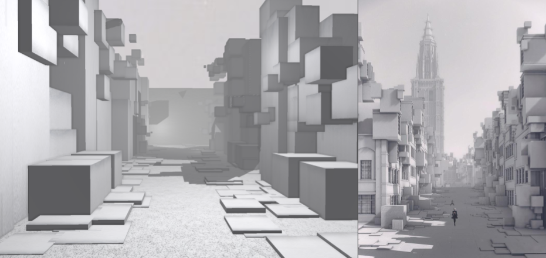

# Copied City - Procedural Generation

Our goal was to replicate the style of Nier Automata's Copied City as a procedurally generated realtime environment using OpenGL.

Here is a side-by-side of our results versus a screenshot from the game:

More results:

## Features

- Screen Space Ambient Occlusion (SSAO)
- Procedural Shape Grammar
- Shadow Mapping
- Texture Mapping
- Skybox Mapping
- Fog
